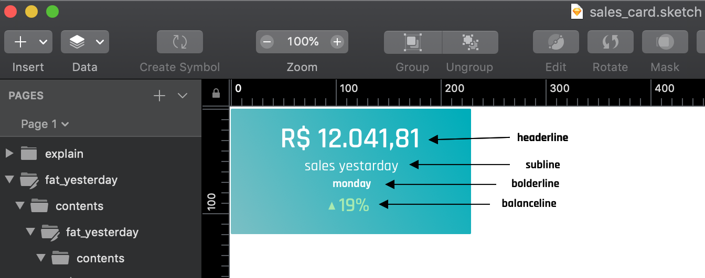
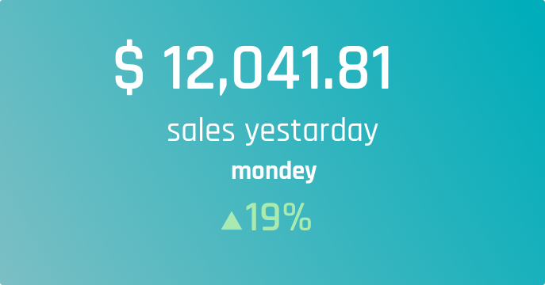

## How to build a analytical business card image using python

## Business card
This project aims to build business analytical cards images to be used embedded or ubiquitous on no convetional applications like: chatbots, messenger, whatsapp, smartwatches and etc. It’s a technique worth discussing on its own. After all, "they say that a picture is worth 1000 words. So that means a picture that actually contains words must be worth way more".

In this article I will demonstrate how create a python card renderer that: load a background image, overlay that image with some texts with customized fonts and colors and save the result as final image. After, I will show how to build a server using this renderer to create an API that can be used to download and to generate dynamic analytical business cards, this cards than can be embedded in other applications like chatbots or live monitors. I am using this approach in some experiments at [bizubox](http://bizubox.com), a startup that I'm a co-founder, trying to bring analytical information in a more user friendly way to our customers.

## The idea
Let’s say you had to send sales information daily to a clint, and you wanted a way to show that with a bit more flair than a excel dashboard, then you have the idea to send some analytical cards using messenger or whatsapp. The concept and the design I developed using [sketch](https://www.sketchapp.com), a vectorized design toolkit, the follwoing picture shows this idea as a business card. The variables (headerline, subline, bolderline, balanceline) will be dynamically rendered using python, let's go to code.



## Python Imaging Library
For this project I will use pillow, a python image manipulation library, and it can be installed with pip. And I will use the flask server to create the API.

```bash
sudo pip install pillow
sudo pip install flask
```

And than import the image lib
```python
from PIL import Image, ImageDraw, ImageFont
```

## Background assets
Ok, now I’ll be loading two external resources: a TrueType font for our text, and a background image, and png overlay triangle icon. Now just declare a function to import the fonts (the density variable is as multiplier to increase the pixel per inch):

```python
def get_fonts(density):
    # Define fonts for regular text and heading
    header_font = ImageFont.truetype("assets/fonts/rajdhani-semibold.ttf", 28*density)
    subline_font = ImageFont.truetype("assets/fonts/rajdhani-medium.ttf", 14*density)
    bolderline_font = ImageFont.truetype("assets/fonts/rajdhani-bold.ttf", 11*density)
    footer_font = ImageFont.truetype("assets/fonts/rajdhani-semibold.ttf", 18*density)
    return header_font, subline_font, bolderline_font, footer_font
```

Going on, I will declare a card render function to put together a very visually appealing final product with minimal effort and code, of course there’s a whole another ways to explore fonts, overlays and many awesome features out there. The first part of the code will add the background degrade image and will add the triangle green icon to that image.  Finally, a surface will add the dynamic texts that I used as the input of the render function:

The intermediary image with background and icon overlay:


The code of the render function:

```python
def card_render(header='', subline='', bolderline='', balanceline='', density=3):
    # Define fonts for regular text and heading
    header_font, subline_font, bolderline_font, footer_font = get_fonts(density)

    # Load background image
    img = Image.open("assets/imgs/card_background@3x.png")

    # Added triangle icon overlay
    icon_overlay = Image.open("assets/imgs/triangle_icon.png")
    img.paste(icon_overlay, (93*density, 89*density), icon_overlay)

    # Build a surface
    surface = ImageDraw.Draw(img)

    # Write heading
    surface.text((47*density, 11*density), header, font=header_font)
    surface.text((70*density, 46*density), subline, font=subline_font)
    surface.text((97*density, 65*density), bolderline, font=bolderline_font)
    surface.text((103*density, 80*density), balanceline, font=footer_font, fill='#A9EAB0')

    return img

def save_img():
    img = card_render(
        header="$ 12,041.81", 
        subline="sales yesterday", 
        bolderline="monday", 
        balanceline="19%", 
        density=3
    )
    img.save(open("rendered/temp_card.png", "wb"), "PNG")
```

The final rendered image:




# Server API
I'm using flask for my application. I'd like to send an image (dynamically generated by PIL) to client without saving on disk.

# References
[MAKING PICTURES WORTH 1000 WORDS IN PYTHON] (https://hackaday.com/2018/03/21/making-pictures-worth-1000-words-in-python/) 

